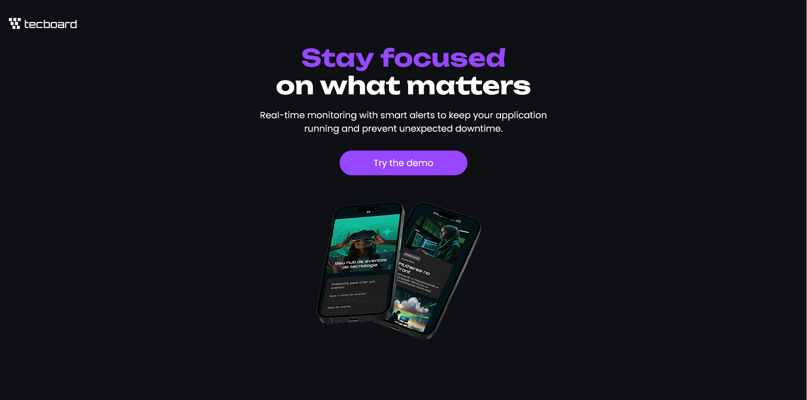

# Tecboard Landing Page

A responsive landing page for a monitoring platform, built with HTML and CSS.

## Features

- Responsive landing page
- Custom fonts
- Hero section
- Call to action button

## Technologies

- HTML
- CSS

## Project Structure

- index.html
- style.css
- assets/

## Future Improvements

- Add hover effects
- Improve accessibility
- Add smoother responsive behavior
- Publish a live demo

## Screenshot



## How to run

1. Clone the repository

```bash
git clone https://github.com/eduardo-heck/tecboard-landing-page.git

2. Open the project folder.

3. Open index.html in your browser.